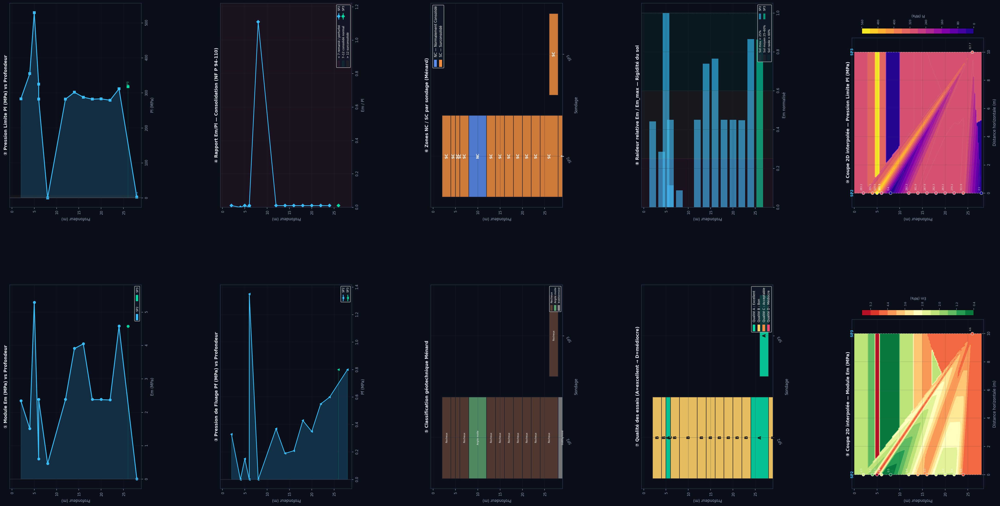

# PressiomètreIA v2 — SETRAF Gabon

**Logiciel de traitement et d'interprétation des essais pressiométriques Ménard**  
Bureau d'études géotechniques SETRAF — Port-Gentil, En face du Stade PERENCO, Gabon

---

## Présentation du logiciel

PressiomètreIA est un outil professionnel complet pour le traitement automatisé des essais pressiométriques Ménard (norme **NF P 94-110**). Il combine une interface graphique moderne, un moteur de calcul géotechnique rigoureux et un assistant IA local spécialisé en géosciences.

### Fonctionnalités principales

| Module | Description |
|--------|-------------|
| **Données** | Import de fichiers Excel multi-sondages (SP), nettoyage, détection d'anomalies |
| **Analyse** | Calcul automatique des paramètres Ménard : Em, Pf, Pl, Pl\*, classification NC/SC, qualité A/B/C/D |
| **Profil** | Visualisation des courbes P-V et profils de paramètres par sondage |
| **Section** | Coupes géotechniques 2D interpolées (Pl, Em) entre sondages |
| **Cloud 3D** | Nuage de points 3D interactif des paramètres pressiométriques |
| **KIBALI IA** | Assistant conversationnel géotechnique local (Mistral-7B NF4 4-bit) avec mémoire du projet |
| **Rapports** | Génération PDF professionnelle : rapport standard, rapport complet (~35 pages), export conversation |

---

## Prérequis matériel

- **OS** : Windows 10 / 11 (64-bit)
- **RAM** : minimum 16 Go (32 Go recommandé pour l'IA)
- **GPU** : NVIDIA avec CUDA ≥ 11.8 (recommandé pour KIBALI) — fonctionne en CPU sans GPU
- **Espace disque** : ~15 Go (dont ~14 Go pour le modèle KIBALI)
- **Python** : 3.11 (fourni dans le dossier `environment/`)

---

## Installation

### 1. Cloner le dépôt

```bash
git clone https://github.com/lojol469-cmd/Pressiometre.git
cd Pressiometre
```

### 2. Installer les dépendances Python

Le dossier `environment/` contient un Python 3.11 portable. Installez les packages avec :

```bash
environment\python.exe -m pip install -r environment\requirements.txt
```

Packages principaux installés :
- `PyQt6` + `PyQt6-WebEngine` — interface graphique
- `fastapi` + `uvicorn` — serveur API interne
- `torch` ≥ 2.0 — moteur IA (avec CUDA si GPU disponible)
- `transformers` + `bitsandbytes` — chargement KIBALI NF4 4-bit
- `numpy`, `scipy`, `matplotlib`, `plotly` — calculs et visualisations
- `reportlab` — génération PDF
- `openpyxl` — lecture des fichiers Excel pressiométriques

### 3. Télécharger le modèle KIBALI

Le modèle IA **KIBALI** (Mistral-7B géophysique finement ajusté) n'est pas inclus dans le dépôt (trop volumineux). Téléchargez-le depuis Hugging Face :

```bash
# Option A — avec huggingface-hub (recommandé)
environment\python.exe -m pip install huggingface_hub
environment\python.exe -c "from huggingface_hub import snapshot_download; snapshot_download('BelikanM/kibali-final-merged', local_dir='kibali-final-merged')"

# Option B — avec git-lfs
git lfs install
git clone https://huggingface.co/BelikanM/kibali-final-merged
```

Le dossier `kibali-final-merged/` doit contenir :
```
kibali-final-merged/
├── config.json
├── tokenizer.json
├── tokenizer_config.json
├── model-00001-of-00003.safetensors   (~4.5 Go)
├── model-00002-of-00003.safetensors   (~4.5 Go)
└── model-00003-of-00003.safetensors   (~4.5 Go)
```

> Sans le modèle, tous les onglets fonctionnent normalement — seul l'onglet **KIBALI IA** sera indisponible.

---

## Lancement

Double-cliquez sur **`LANCER_V2.bat`** ou exécutez dans un terminal :

```bash
.\LANCER_V2.bat
```

Ce script lance automatiquement :
1. Le serveur **FastAPI** (port 8502) en arrière-plan
2. L'interface graphique **PyQt6** (`launcher.py`)
3. Le chargement asynchrone du modèle KIBALI (en tâche de fond)

---

## Structure du projet

```
Pressiometre/
├── app.py                    # Point d'entrée FastAPI
├── launcher.py               # Point d'entrée GUI PyQt6
├── LANCER_V2.bat             # Script de lancement Windows
├── environment/              # Python 3.11 portable
│   └── requirements.txt      # Liste des dépendances
├── api/
│   ├── main.py               # Routes FastAPI
│   ├── parser.py             # Lecture fichiers Excel pressiométriques
│   ├── cleaner.py            # Nettoyage et détection anomalies
│   ├── calculator.py         # Calculs Ménard (Em, Pf, Pl, Pl*)
│   ├── norms.py              # Tables de normes NF P 94-110
│   ├── models.py             # Modèles de données Pydantic
│   ├── kibali.py             # Interface modèle IA KIBALI
│   ├── report.py             # Rapport standard PDF
│   ├── report_full.py        # Rapport complet ~35 pages PDF
│   └── report_chat.py        # Export conversation PDF
├── frontend/
│   ├── main_window.py        # Fenêtre principale PyQt6
│   ├── theme.py              # Thème visuel (couleurs, polices)
│   └── widgets/
│       ├── data_tab.py       # Onglet import/visualisation données
│       ├── analysis_tab.py   # Onglet analyses et tableaux
│       ├── profile_tab.py    # Onglet courbes P-V et profils
│       ├── section_tab.py    # Onglet coupes géotechniques 2D
│       ├── cloud3d_tab.py    # Onglet nuage 3D interactif
│       ├── ai_tab.py         # Onglet assistant KIBALI IA
│       └── report_tab.py     # Onglet génération de rapports
├── kibali-final-merged/      # Modèle KIBALI (à télécharger)
└── assets/                   # Icônes et logo
```

---

## Format attendu des fichiers d'entrée

Les fichiers Excel doivent contenir **un onglet par sondage pressiométrique** (SP).  
Chaque onglet doit avoir la structure suivante :

| Colonne | Description |
|---------|-------------|
| Profondeur (m) | Profondeur de mesure |
| P0 (MPa) | Pression de départ |
| V0 (cm³) | Volume initial |
| P1, P2, … | Pressions des paliers (MPa) |
| V1, V2, … | Volumes correspondants (cm³) |

---

## Modèle IA — KIBALI

**KIBALI** est un modèle Mistral-7B-Instruct-v0.2 finement ajusté avec 18 adaptateurs LoRA spécialisés en géophysique et géotechnique.

- **Base** : `mistralai/Mistral-7B-Instruct-v0.2`
- **Quantification** : NF4 4-bit (BitsAndBytes) → ~5 Go en VRAM
- **Hugging Face** : `BelikanM/kibali-final-merged`
- **Langue** : Français / Anglais
- **Spécialités** : Pressiométrie, ERT, géotechnique, hydrogéologie, risques naturels

Le modèle est chargé **localement** depuis le dossier `kibali-final-merged/` — aucune connexion internet n'est requise à l'utilisation.

---

## Normes implémentées

- **NF P 94-110** (1991 + 2000) — Essai pressiométrique Ménard
- **Fascicule 62** — Règles de calcul des fondations superficielles
- **Eurocode 7 (EC7)** — Calcul géotechnique
- **DTU 13.12** — Règles de calcul des fondations superficielles

---

## Capture d'écran



---

## Développé par

**SETRAF — Bureau d'études Géotechniques**  
Port-Gentil — En face du Stade PERENCO — Gabon  
Logiciel développé avec Python 3.11, FastAPI, PyQt6, KIBALI IA

---

## Licence

Propriétaire — SETRAF Gabon. Tous droits réservés.
